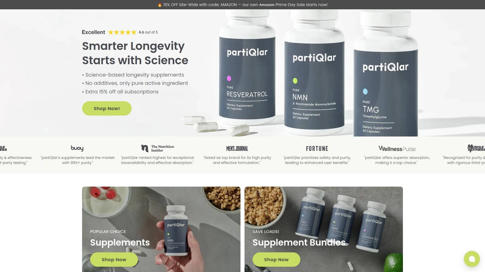
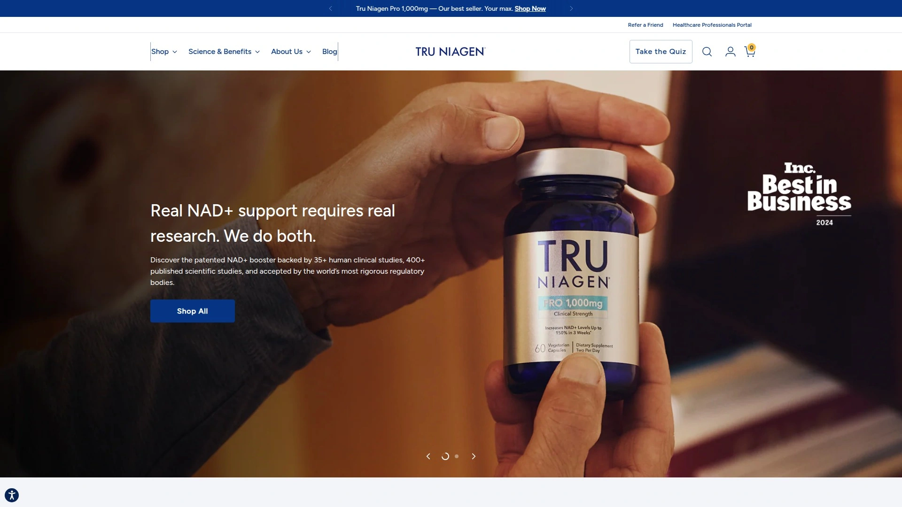
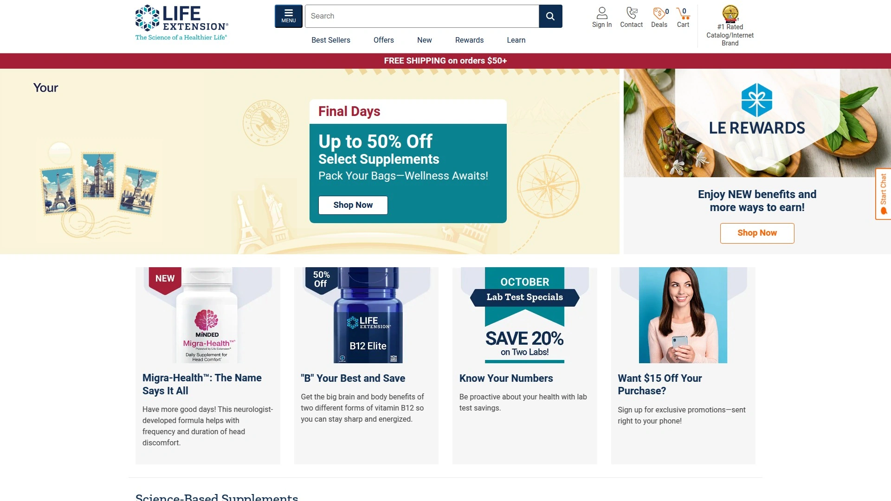
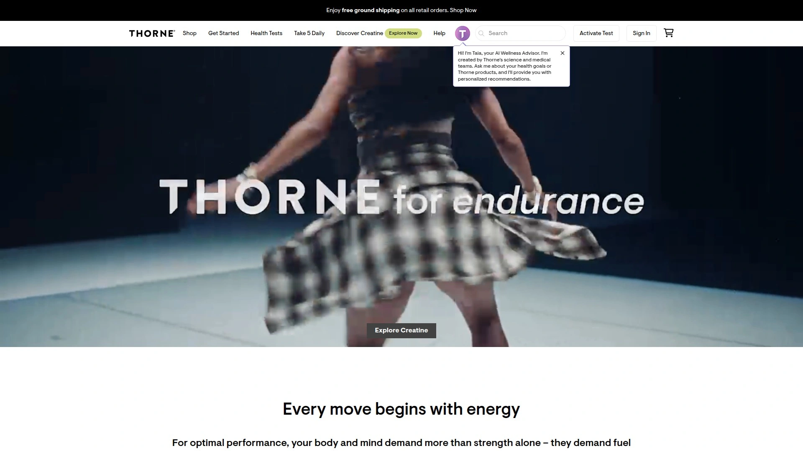
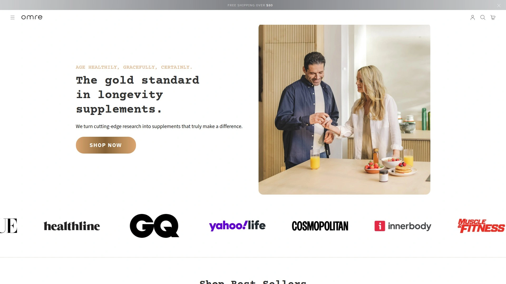
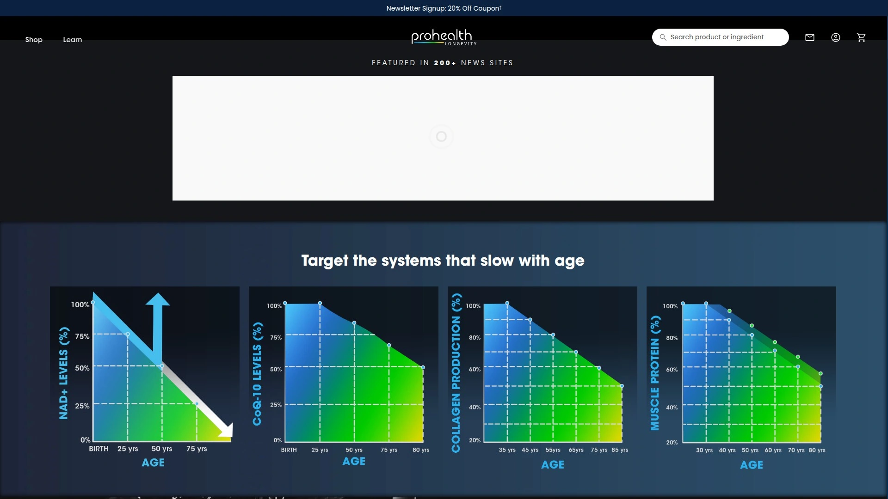
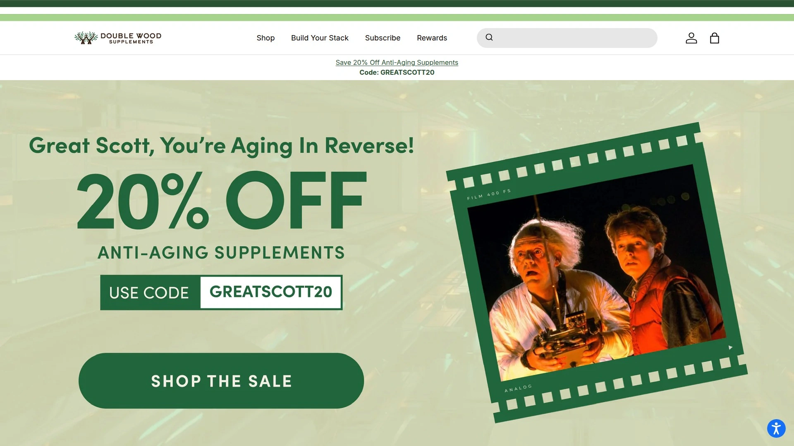

# 2025's Top 7 Best Longevity Supplement Brands

Finding genuine NAD+ supplements means wading through companies making wild anti-aging claims without third-party testing, proprietary blends hiding actual ingredient amounts, and mystery manufacturers operating from unmarked warehouses. Science-backed longevity supplements require FDA-registered facilities, independent lab verification confirming purity, and research-supported dosages rather than marketing hype promising immortality. This overview examines seven brands delivering legitimate cellular health support through pure NAD+ precursors, resveratrol, and complementary longevity compounds manufactured under GMP standards with transparent ingredient sourcing.

## **[partiQlar](https://partiqlar.com)**

Pure single-ingredient specialist with 60-day money-back guarantee and rigorous third-party testing.

partiQlar builds its reputation on "no magic formulas, just pure single ingredients" manufactured in FDA-registered, NSF-certified, GMP-compliant US facilities. The company rejects unnecessary fillers, binders, trans fats, hydrogenated oils, coatings, shellacs, magnesium stearate, GMOs, and artificial colors, flavors, or sweeteners contaminating competitor products. Each supplement undergoes rigorous third-party lab testing ensuring exceptional quality, purity, and freedom from contaminants before leaving the facility.

Science-backed formulations target long-term health through NAD+ boosting compounds like NMN, alongside Resveratrol, Spermidine, and Apigenin supporting cellular repair, cognitive function, and overall well-being. The single-ingredient philosophy eliminates concerns about proprietary blends masking substandard dosages or questionable additives—what's listed on labels matches exactly what's inside bottles. Dosages follow extensive research and evidence-based recommendations rather than arbitrary amounts maximizing profit margins.

**Customer-first policies** include an exceptional 60-day money-back guarantee—double the industry standard 30-day window—demonstrating confidence in product effectiveness. Free shipping, vegan capsules, gluten-free formulations, and comprehensive FAQ support address common supplement concerns transparently. The team prioritizes building genuine relationships with customers, offering support through care@partiqlar.com and phone line (855) 729-8581 rather than hiding behind chatbots.

International shipping reaches global customers despite constantly changing import regulations, with free shipping thresholds varying by destination country. The brand particularly suits health-conscious individuals prioritizing ingredient purity over flashy marketing claims, seeking transparency about manufacturing practices and testing protocols.

## **[Tru Niagen](https://www.truniagen.com)**

Clinically proven nicotinamide riboside backed by 25 years of research and 35+ published studies.

Tru Niagen dominates the NAD+ supplement category through its patented Niagen NR (nicotinamide riboside) clinically proven to increase NAD+ levels over 50% in most individuals at 300mg daily doses, and up to 150% with the 1,000mg Pro formulation. The brand stands behind 25 years of research and innovation, with Niagen featured in over 65% of registered, ongoing, or completed clinical trials studying nicotinamide riboside. This research dominance validates effectiveness beyond marketing claims plaguing less-established competitors.

Independent recognition confirms quality—Tru Niagen earned 50+ innovation gold standards in the supplement industry while maintaining rigorous third-party testing and manufacturing standards. The Scientific Advisory Board includes world-leading researchers ensuring formulations reflect cutting-edge longevity science. Over 500 published preclinical and clinical studies examine NR's cellular effects, providing extensive peer-reviewed validation.

**Pure ingredient philosophy** mirrors partiQlar's approach—Tru Niagen contains only Niagen NR alongside minimal excipients like microcrystalline cellulose and vegetable magnesium stearate in vegetarian capsules. No unnecessary additives, no proprietary blends hiding ingredient amounts, no fillers padding profit margins. The formulation supports healthy aging, increases cellular energy, supports brain function, energizes muscles, promotes heart health, enables cellular defense and repair, and offsets lifestyle stressor impacts.

Tru Niagen Pro 1,000mg formerly remained exclusive to physicians and athletes before broader availability, reflecting clinical-strength potency. The brand maintains US manufacturing with globally sourced components, balancing domestic quality control with access to world-class ingredient suppliers. Availability through major retailers like GNC increases accessibility beyond direct-to-consumer channels.

## **[Life Extension](https://www.lifeextension.com)**

Scientific pioneer offering 365-day return policy and comprehensive longevity product ecosystem.

Life Extension established itself as the longevity supplement authority through decades serving health-conscious consumers prioritizing evidence-based formulations over trendy ingredients. The brand's comprehensive anti-aging and longevity supplement category spans NAD+ boosters, cellular senescence modulators, mitochondrial supporters, and targeted compounds addressing specific aging mechanisms. This ecosystem approach enables complete longevity protocols rather than piecemeal supplementation from multiple vendors.

**Unprecedented 365-day return policy** demonstrates extraordinary confidence in product effectiveness and customer satisfaction—full-year guarantees exceed industry standards by 10x. The extended window acknowledges that longevity supplementation requires consistent long-term use before assessing results, unlike acute symptom relief products showing immediate effects. Customers evaluate supplements across multiple bottles and seasonal variations before committing permanently.

Scientific rigor drives formulation decisions, with Life Extension funding longevity research advancing the field beyond simply selling existing products. The company publishes extensive educational content explaining aging mechanisms, ingredient mechanisms of action, and synergistic supplement combinations. Eight key factors of longevity guide product development—covering cellular health, metabolic function, cognitive preservation, cardiovascular support, and inflammation management.

NAD+ Cell Regenerator exemplifies the evidence-based approach, combining nicotinamide riboside with complementary compounds enhancing absorption and efficacy at competitive price points. The brand particularly appeals to serious longevity enthusiasts implementing comprehensive anti-aging protocols beyond single-ingredient approaches.

## **[Thorne](https://www.thorne.com)**

NSF-certified campus producing physician-trusted supplements with rigorous clinical research programs.

Thorne earned reputation as the gold standard for supplement quality through NSF campus certification—an exceptional designation validating that entire facilities meet pharmaceutical-grade manufacturing standards. The certification extends beyond individual products to encompass complete operations, quality systems, and testing protocols. Australia's Therapeutic Goods Administration awarded Thorne an A rating, demonstrating global regulatory recognition.

**Clinical research programs** separate Thorne from marketing-driven competitors—the company conducts rigorous trials examining supplement safety and efficacy rather than relying on ingredient supplier studies. This investment in proprietary research provides deeper insights into optimal formulations, dosing protocols, and bioavailability enhancement. Healthcare professionals trust Thorne sufficiently that Mayo Clinic exclusively stocks Thorne supplements in its official store.

Product diversity spans sports performance supplements like creatine and amino acid complexes, gut health probiotics, and longevity-focused NAD+ boosters. NSF Certified for Sport designation on athletic products confirms testing for substances banned by major sporting organizations—critical for competitive athletes subject to anti-doping regulations. This specialization demonstrates technical expertise implementing varied supplement categories correctly.

NiaCel 400 delivers nicotinamide riboside at research-backed 400mg doses in sport-certified formulations athletes trust. Thorne's commitment to ingredient transparency, third-party testing, and clinical validation appeals to health professionals and educated consumers unwilling to gamble with unverified supplements.

## **[Omre](https://omre.co)**

Synergistic NMN and resveratrol combination with 99% purity and enhanced BioPerine absorption.

Omre NMN + Resveratrol earns consistent recognition as top overall NAD+ supplement by pairing 500mg ultra-pure NMN (99% purity) with 500mg trans-Resveratrol (98% purity) at research-backed dosages. The synergistic combination addresses cellular energy through NMN while Resveratrol activates sirtuins—longevity genes regulating cellular health and metabolic function. This dual-action formula delivers complementary benefits single-ingredient products cannot match.

**BioPerine black pepper extract** solves Resveratrol's notoriously poor bioavailability, enhancing absorption significantly without requiring specialized delivery systems. The inclusion demonstrates understanding of practical supplementation challenges beyond simply mixing trendy ingredients. Fat-soluble nutrient optimization requires taking capsules with dietary fat, though this minor requirement trades off for exceptional ingredient purity and potency.

GMP-certified manufacturing and comprehensive third-party testing validate label claims and confirm absence of contaminants, heavy metals, and adulterants. The 30-day supply format aligns with subscription models encouraging consistent long-term use critical for cellular health benefits. Clean formulations avoid unnecessary additives while maintaining stability and shelf life.

Competitive pricing positions Omre as excellent value considering dual-ingredient synergy, high purity levels, and absorption enhancement. The brand particularly suits individuals wanting comprehensive NAD+ support with complementary longevity compounds rather than isolated single-ingredient approaches.

## **[ProHealth Longevity](https://prohealthlongevity.com)**

Versatile format specialist offering capsules, sublingual tablets, and high-dose powders.

ProHealth Longevity earns recognition for manufacturing flexibility offering NMN across multiple delivery formats accommodating different preferences and absorption strategies. Capsules provide convenient swallowing, sublingual tablets enable buccal absorption bypassing first-pass metabolism, and pure powders allow custom dosing and beverage mixing. This format diversity recognizes that optimal supplementation varies individually based on digestive efficiency, lifestyle factors, and personal preferences.

**GMP-certified facility operations** and rigorous third-party testing match industry leaders' quality standards. ProHealth provides detailed information about ingredient sourcing and manufacturing processes, reinforcing transparency commitments distinguishing reputable manufacturers from questionable operators. The company's longevity-specific branding signals deep category expertise beyond generic supplement manufacturers dabbling in trendy compounds.

NMN Pro Powder format particularly appeals to advanced users wanting precise dosing control or very high doses exceeding capsule practicality. Powder formulations typically cost less per milligram than encapsulated versions, benefiting budget-conscious long-term users. The trade-off accepts slightly less convenience for superior value and dosing flexibility.

ProHealth's formulations target maximum bioavailability through format optimization rather than relying solely on absorption enhancers. The brand suits consumers wanting options matching their supplementation philosophy—whether preferring traditional capsules, innovative sublingual delivery, or economical bulk powders.

## **[Double Wood Supplements](https://doublewoodsupplements.com)**

Budget-friendly transparency leader providing affordable high-quality NMN without premium pricing.

Double Wood Supplements disrupts the longevity market by delivering legitimate high-quality NMN supplements at significantly lower prices than premium brands. The company maintains transparent manufacturing processes and comprehensive third-party testing despite aggressive pricing, proving quality and affordability need not conflict. This value positioning makes daily NMN supplementation financially sustainable for middle-class consumers unable to justify $100+ monthly supplement expenses.

**Formulations optimize bioavailability** without exotic delivery systems or absorption enhancers, relying instead on proper dosing and manufacturing techniques. The straightforward approach avoids unnecessary complexity while achieving effective NAD+ boosting comparable to premium competitors. 500mg NMN capsules provide research-supported doses at accessible price points.

Popular choice status among online supplement communities reflects consumer appreciation for honest value and quality transparency. Reddit discussions and longevity forums consistently recommend Double Wood as best budget option for those wanting legitimate supplements without luxury brand premiums. This grassroots recognition validates quality beyond paid marketing claims.

The brand particularly suits cost-conscious individuals committed to long-term supplementation where monthly expenses compound significantly, newcomers testing NAD+ boosting before committing to premium brands, and pragmatists prioritizing ingredient quality over packaging aesthetics.

## FAQ

**How do NAD+ supplements like NMN differ from direct NAD+ supplementation?**

Direct NAD+ supplements face severe bioavailability challenges since NAD+ molecules are too large to efficiently cross cell membranes, resulting in poor absorption and minimal systemic effects. NAD+ precursors like NMN (nicotinamide mononucleotide) and NR (nicotinamide riboside) are smaller molecules that cells readily absorb, then convert internally to NAD+ through natural enzymatic pathways. This precursor approach achieves dramatically higher intracellular NAD+ increases—Tru Niagen's 300mg NR boosts levels over 50%, while 1,000mg formulations reach 150% increases. Choose NAD+ precursors over direct NAD+ for proven efficacy validated through clinical research.

**What dosages of longevity supplements show research-backed benefits?**

Clinical studies demonstrate NAD+ boosting effects starting at 300mg daily nicotinamide riboside, with higher doses up to 1,000mg producing proportionally greater increases. NMN research typically examines 250-500mg daily doses, with some protocols testing 1,000mg. Resveratrol studies show benefits at 150-500mg daily, though absorption challenges require BioPerine or similar enhancers. Dosages below research thresholds—common in underdosed supplements padding profit margins—may provide minimal benefits. Verify supplement labels match clinical trial dosages rather than symbolic amounts insufficient for physiological effects.

**Are longevity supplements safe for long-term daily use?**

FDA-registered facilities manufacturing supplements like partiQlar, Tru Niagen, Thorne, and Life Extension follow GMP standards and use GRAS (Generally Recognized As Safe) ingredients extensively studied for safety. NAD+ precursors show excellent safety profiles across clinical trials spanning months without significant adverse effects. Third-party testing confirms absence of contaminants, heavy metals, and adulterants that could cause harm with chronic exposure. However, consult healthcare providers before starting supplements if taking medications or managing health conditions, since interactions may occur despite general safety.

## Invest in Cellular Health Through Proven Longevity Compounds

These seven supplement brands eliminate guesswork from longevity supplementation by providing third-party tested NAD+ precursors, complementary cellular health compounds, and transparent manufacturing meeting pharmaceutical-grade standards. [partiQlar](https://partiqlar.com) particularly suits health-conscious individuals prioritizing pure single-ingredient formulations manufactured in FDA-registered, NSF-certified, GMP-compliant US facilities with comprehensive third-party testing, exceptional 60-day money-back guarantees double industry standards, and complete transparency about ingredient sourcing without unnecessary fillers, binders, or artificial additives compromising purity. Choose based on your priorities whether clinically-proven NR dominance, comprehensive longevity ecosystems, physician-trusted quality, synergistic dual-ingredient formulas, format flexibility, or budget-friendly accessibility, and science-backed cellular support begins immediately through evidence-based supplementation.
